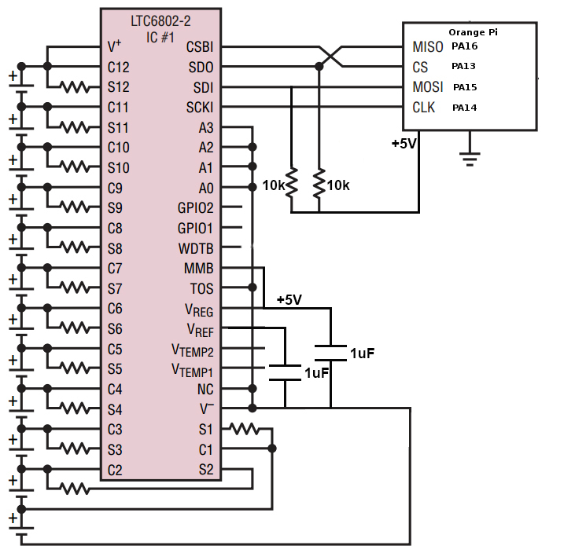

# python-LTC6802
Interface LTC6802 with Raspberry/Orange Pi using Python.

LTC6802 Operates on SPI protocol.

The ciruit Diagram for interfacing LTC6802 with Raspberry/OrangePi



    The given Circuit Diagram is for OrangePi; therefore the pins are labeled as
    PA13-PA16. If you are interfacing this IC with RaspberryPi then connect the
    CLK, MISO, MOSI, CS pins of it to the CLK, MISO, MOSI and CS pins of
    RaspberryPi, which are pin no 23, 21, 19 and 24/26 Respectively.
    
## Dependencies

```bash
$ pip install python-periphery
```

to install pyA20 (for OrangePi):

```bash
$ pip install pyA20
```

to install RPi.GPIO (for RaspberryPi):

```bash
$ pip install RPi.GPIO
```

Other details (that I know) about the IC LTC6802 are
posted [here](http://www.girishjoshi.io/post/LTC6802-2-Python/)


